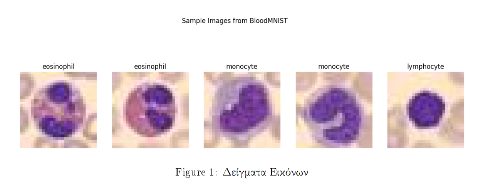
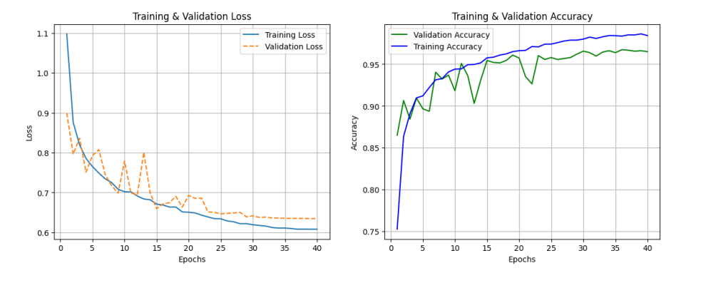

# Deep Learning Project

Image classification on the **BloodMNIST** dataset (8-class blood cell classification, 28×28 RGB images) using a variety of deep learning methods implemented in PyTorch.

## Implemented Methods

### Custom CNNs

- **SimpleCNN** — 3-block convolutional neural network (32→64→128 channels) with max pooling and fully connected layers
- **Batch Normalization** — `BatchNorm2d` applied after each convolutional layer to stabilize training
- **Layer Normalization** — normalization across channels and spatial dimensions as an alternative to batch normalization
- **Dropout Regularization** — stochastic regularization tested at rates 0.2, 0.5, and 0.7
- **Weight Decay (L2 Regularization)** — optimizer-level regularization tested at 1e-4, 1e-3, and 1e-2
- **Combined CNN (Layer Norm + Dropout)** — hybrid architecture combining layer normalization and dropout with hyperparameter tuning

### Transfer Learning (ResNet18)

- **Feature Extraction** — frozen pre-trained ResNet18 backbone (ImageNet weights) with only the classifier head trained
- **Fine-Tuning** — selective unfreezing of the last convolutional blocks (layer3, layer4) for end-to-end training

### Vision Transformers (DeiT)

- **DeiT Tiny** — Data-efficient Image Transformer (`deit_tiny_patch16_224`) with 16×16 patch embeddings
- **Transformer Feature Extraction** — training only the DeiT classifier head with a frozen backbone
- **Transformer Fine-Tuning** — unfreezing the last 2 transformer blocks and norm layer for selective training

### Data Augmentation

- **Random Horizontal Flip** — 50% probability flip for invariance
- **Random Rotation** — ±10° rotation for geometric robustness
- **Input Resizing & Normalization** — resizing to 224×224 with ImageNet mean/std normalization for pre-trained models

### Training Techniques

- **Cross-Entropy Loss** — standard multi-class classification loss
- **Weighted Cross-Entropy Loss** — class-balanced loss using inverse frequency weights
- **Label Smoothing** — 0.1 smoothing factor to prevent overconfident predictions
- **Adam Optimizer** — adaptive learning rate optimization (learning rates from 1e-4 to 5e-3)
- **Cosine Annealing LR Scheduler** — dynamic learning rate decay over training epochs

### Results

## Repository Structure

- `Code.ipynb` — full implementation and experiments
- `Project.pdf` — project task
